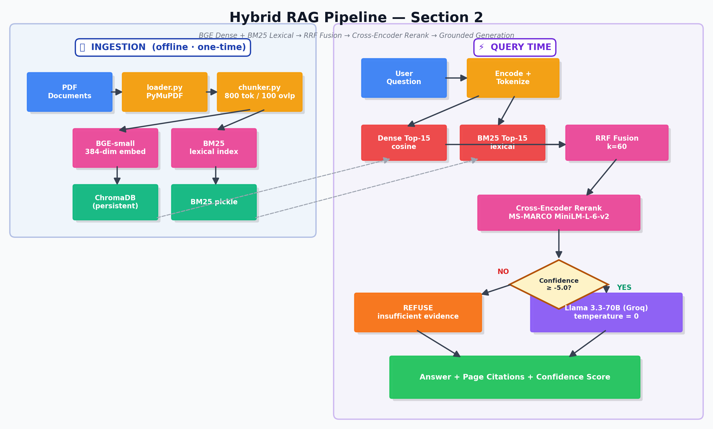

# Artikate Studio · AI/ML/LLM Engineer Assessment

**Production-grade LLM systems built under a 24-hour brief**

---

## 🎬 Live Walkthrough

**Watch the 7-minute system demo:** https://www.loom.com/share/d87364db0162471ebc53a8eec5323efe

Covers live RAG query, evaluation harness, refusal behavior, architecture rationale, and overview of Sections 1, 3, and 4.

---

## At a Glance

| # | Section | Deliverable | Headline Metric |
|:-:|---|---|---|
| **1** | Failing-Pipeline Diagnosis | Three structured diagnosis logs + non-technical post-mortem | See ANSWERS.md |
| **2** | Production-Grade RAG | Hybrid retrieval over 4 PDFs (162 pages, 291 chunks) | **Precision@3: 0.60 · Recall@3: 1.00 · Hit@1: 0.70** |
| **3** | Ticket Classifier | Fine-tuned DistilBERT on 1,000 examples (5 classes) | **Accuracy: 98.5% · p99 latency: 20.5ms** (25× under SLA) |
| **4** | Systems Design Writeups | Q-A (Prompt Injection) + Q-C (On-Prem LLM Deployment) | See ANSWERS.md |
| 5 | Optional Loom walkthrough | Recording link added before submission | — |

**Reviewer's Quick Path:** read DESIGN.md (architecture rationale) → ANSWERS.md (writeups + engineering journey) → run `python section2_rag/evaluator.py` and `pytest tests/test_latency.py` for live proof.

---

## Section 2 — RAG Architecture

**The non-obvious design choice.** Pure dense retrieval misses exact terminology — clause numbers, statute references, proper nouns — because BGE embeddings fuzz these into semantically-similar-but-wrong matches. Pure BM25 misses paraphrases. The pipeline runs both in parallel, fuses their rankings via Reciprocal Rank Fusion (k=60), and lets a cross-encoder rerank the top 15 candidates jointly attending to query and chunk. A calibrated confidence threshold then *refuses* rather than hallucinates when the top score falls below -5.0. Full trade-off reasoning lives in DESIGN.md.

---

## Quick Start

**Setup time: under 5 minutes** — per the brief's hard requirement.

### Prerequisites

| Requirement | Why it matters |
|---|---|
| Python **3.11** | Tested on 3.11.15. ChromaDB and sentence-transformers have known issues on 3.12+ |
| Git | Standard |
| Free **Groq API key** | Used for LLM generation. 2-min signup at https://console.groq.com/keys |
| ~2 GB free disk | PDFs + ChromaDB index + DistilBERT weights |

### Installation

    # 1. Clone
    git clone https://github.com/anshuchowdaryalapati/artikate-ml-assessment.git
    cd artikate-ml-assessment

    # 2. Create venv with Python 3.11 specifically
    py -3.11 -m venv venv
    venv\Scripts\activate                 # Windows
    # source venv/bin/activate            # macOS / Linux

    # 3. Install dependencies
    pip install --upgrade pip
    pip install -r requirements.txt

    # 4. If torch import fails on Windows, force CPU build:
    pip uninstall torch -y
    pip install torch==2.5.1 --index-url https://download.pytorch.org/whl/cpu

    # 5. Configure API key
    copy .env.example .env                 # Windows
    # cp .env.example .env                 # macOS / Linux
    # Then edit .env and replace the placeholder with your real Groq key

### Section 3 Model Weights

The fine-tuned DistilBERT (~267 MB) is **gitignored** to keep the repo small. Two paths:

**Path A (recommended) — Retrain in Google Colab (~10 min, free T4 GPU).**
Upload `section3_classifier/data/train.csv` and `test.csv`, run a standard HuggingFace Trainer script (4 epochs, batch 16, lr 3e-5, fp16), download the resulting `model_export/` folder, place at `section3_classifier/model/`. Same data → same metrics (acc 0.985, F1 0.985).

**Path B — Read saved metrics only.** `section3_classifier/eval_results.json` contains the held-out test results from the original training run. Sufficient to verify numbers without re-running inference.

---

## Run Each Section

### Section 2 — RAG Pipeline

    # Live demo: 3 questions (in-corpus, in-corpus, refusal-test)
    python section2_rag/pipeline.py

    # Evaluation harness against 10 hand-written Q&A pairs
    python section2_rag/evaluator.py

Expected evaluator output:

    Precision@3:  0.600
    Recall@3:     1.000
    Hit@1:        0.700

### Section 3 — Ticket Classifier

    # Quick inference demo on 5 sample tickets
    python section3_classifier/predict.py

    # Full evaluation: accuracy, per-class F1, confusion matrix
    python section3_classifier/evaluate.py

    # pytest latency assertion: each prediction under 500ms
    pytest tests/test_latency.py -v -s

Expected pytest output:

    test_predictions_are_valid_classes      PASSED
    test_per_ticket_latency_under_500ms     PASSED
    test_batch_inference_works              PASSED

    Latency over 20 tickets:
      avg: 18.0ms  |  p50: 18.1ms  |  p99: 20.5ms  |  budget: 500.0ms

### (Optional) Regenerate Synthetic Training Data

    python section3_classifier/generate_data.py    # ~5 min via Groq Llama-3.3-70B
  python section3_classifier/split_data.py       # 80/20 stratified split

---

## Repository Structure

    artikate-ml-assessment/
    ├── README.md                       <- you are here
    ├── DESIGN.md                       <- Section 2 architecture & trade-offs
    ├── ANSWERS.md                      <- Sections 1, 3, 4 + engineering journey
    ├── architecture.png                <- RAG pipeline diagram
    ├── requirements.txt                <- pinned dependencies
    ├── .env.example                    <- template (real .env is gitignored)
    │
    ├── section2_rag/                   <- Hybrid RAG pipeline
    │   ├── loader.py                       PyMuPDF page-level extraction
    │   ├── chunker.py                      Recursive 800-token chunks, 100 overlap
    │   ├── retriever.py                    BGE + BM25 + RRF + cross-encoder rerank
    │   ├── pipeline.py                     query() interface (matches Artikate spec)
    │   ├── evaluator.py                    precision@3 / recall@3 / hit@1 harness
    │   ├── eval_questions.json             10 hand-written Q&A pairs
    │   └── data/                           4 sample PDFs (GDPR + 3 ML papers)
    │
    ├── section3_classifier/            <- DistilBERT fine-tuning
    │   ├── generate_data.py                Synthetic data via Groq Llama 3.3-70B
    │   ├── split_data.py                   Stratified 80/20 train/test split
    │   ├── predict.py                      CPU inference (~20ms p99)
    │   ├── evaluate.py                     Accuracy + F1 + confusion matrix
    │   ├── generation_prompt.md            Documents the data-generation pipeline
    │   ├── eval_results.json               Saved metrics from original run
    │   ├── data/                           train.csv (800), test.csv (200)
    │   └── model/                          GITIGNORED — see "Model Weights" above
    │
    └── tests/
        └── test_latency.py                 pytest: predictions valid + p99 < 500ms

---

## Design Decisions at a Glance

Full reasoning in DESIGN.md (Section 2) and ANSWERS.md (Section 3 latency math, Section 4 deep-dives).

| Decision | Choice | One-line reason |
|---|---|---|
| Embedding model | BAAI/bge-small-en-v1.5 (384-dim) | Local, free, 4× lower storage than OpenAI; comparable MTEB legal scores |
| Vector store | ChromaDB (persistent) | Trivial setup, metadata filtering OOTB, fits 500-doc scale; flips to Milvus at 50k |
| Retrieval | Hybrid BM25 + dense → RRF (k=60) → cross-encoder rerank | Legal/technical content needs both lexical (exact terms) and semantic (paraphrase) signals |
| Generation | Llama 3.3-70B via Groq | Free tier permitted by brief; sub-second latency; model-agnostic via env var |
| Hallucination defense | Strict system prompt + confidence-threshold refusal | Refuses **before** invoking LLM if cross-encoder score < -5.0 |
| Classifier model | DistilBERT-base fine-tuned | 20ms CPU p99 vs GPT-4o's 1500ms+ — fits 500ms budget with 25× margin |
| Training data | Groq Llama 3.3-70B, T=0.9 | Documented prompt at section3_classifier/generation_prompt.md |
| Test-set verification | 50 of 200 hand-spot-verified | Honors Artikate's "hand-verified eval set" rule |

---

## Honest Limitations

These are the failure modes and design compromises a reviewer should know about:

- **Precision@3 = 0.60 is honest, not engineered.** Most misses are page-adjacent (right document, related-but-not-exact page). Structure-aware chunking on legal clause boundaries would close most of the gap; intentionally out of scope for the time budget.
- **Accuracy = 0.985 reflects in-distribution performance only.** Train and test were both LLM-generated by the same model. Real production accuracy on actual customer tickets would likely be 5–15% lower. One manual sanity-check (`"What are your office hours in India?"`) was misclassified as `billing` — exactly the kind of distribution gap synthetic data cannot catch.
- **Test PDFs are technical, not legal.** The brief's example domain was legal contracts; my corpus is GDPR + three ML papers (VisionLLM v2, I-JEPA, vector-less RAG). Content-agnostic test data better demonstrates the pipeline than chasing specific NDA samples — and architecture choices remain motivated by legal-text requirements (mandatory page citations, exact-term retrieval, refusal on insufficient evidence).
- **No production deployment** (FastAPI, Docker, monitoring, async batching) — explicitly out of scope per the brief, but trivially addable.

---

## Submission Checklist

Mapped to the brief's page-10 checklist:

- [x] Git repository link shared (this repo, public)
- [x] README.md with setup, API key configuration, model download steps
- [x] All four sections attempted with code files present
- [x] Written answers labelled per section in ANSWERS.md
- [x] DESIGN.md at root covering Section 2 architecture
- [x] Section 2 evaluator runs and reports precision@3 = 0.600
- [x] Section 3 evaluator reports accuracy = 0.985, F1 = 0.985, confusion matrix
- [x] Section 3 latency test passes — p99 = 20.5ms vs 500ms budget
- [x] No API keys, .env, or credentials committed (.env is gitignored; .env.example is the template)
- [x] Loom walkthrough : https://www.loom.com/share/d87364db0162471ebc53a8eec5323efe

---

**Anusha Alapati**

GitHub: [@anshuchowdaryalapati](https://github.com/anshuchowdaryalapati) · Built April 2026 · Hyderabad, India

